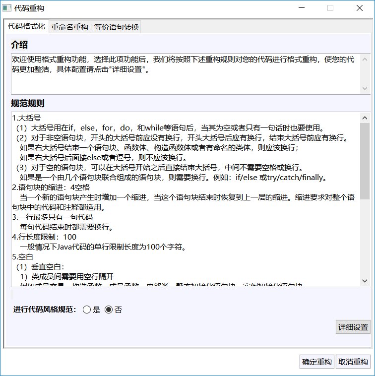
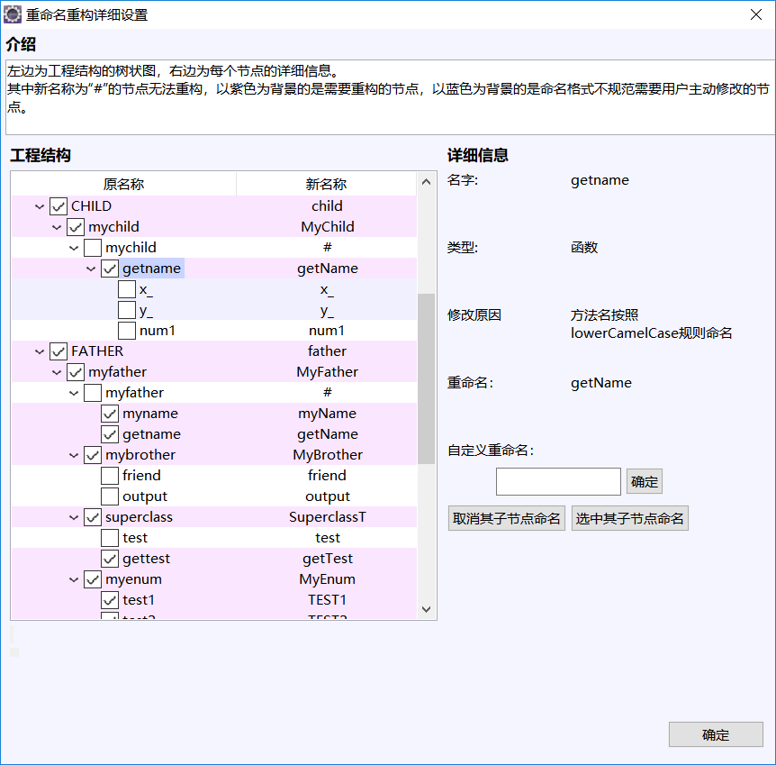
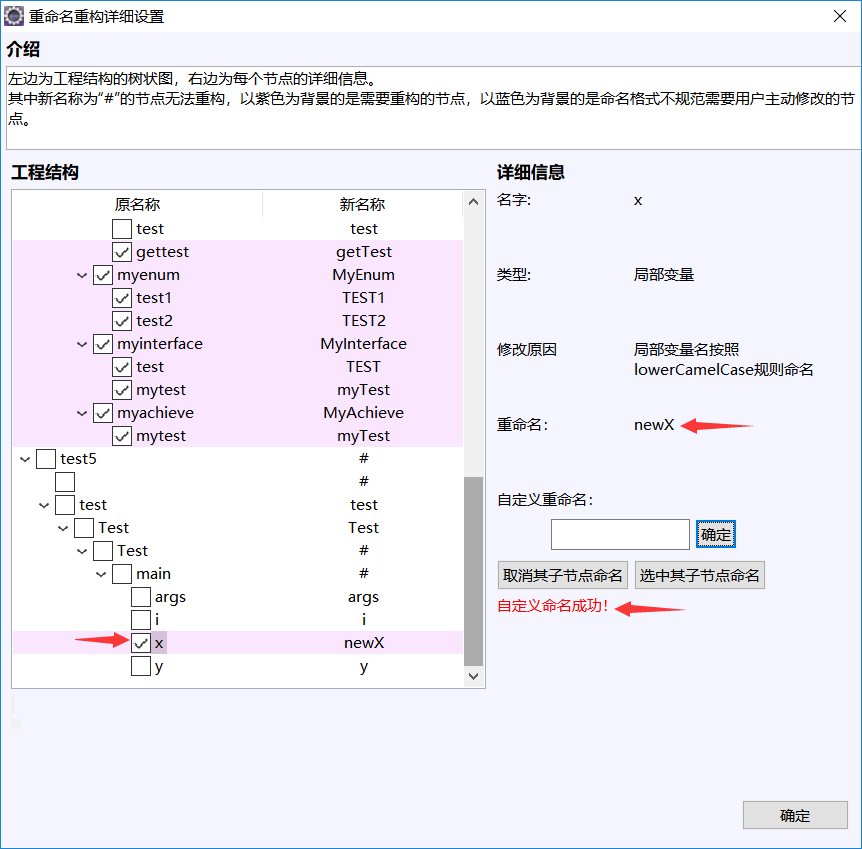
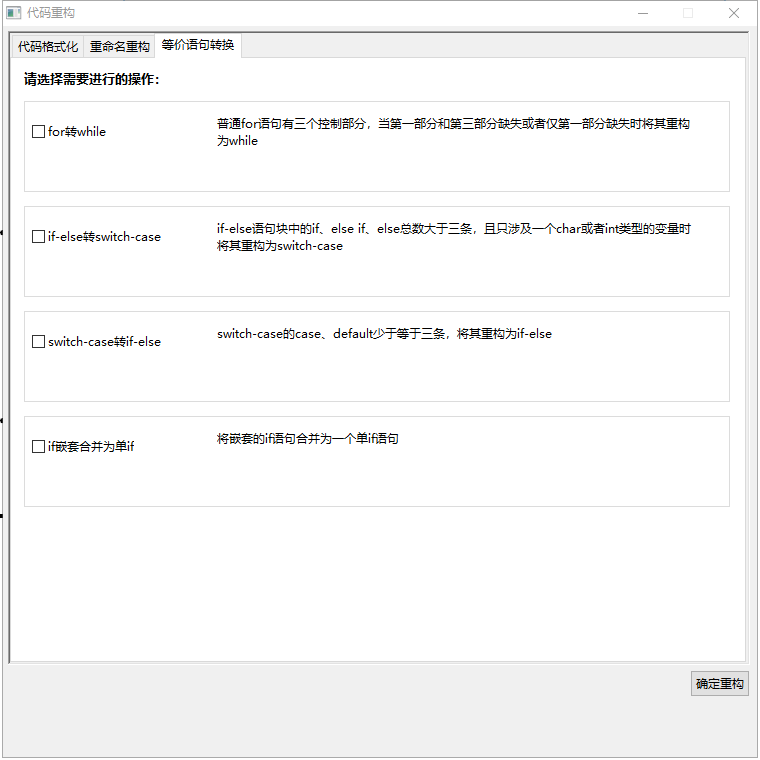
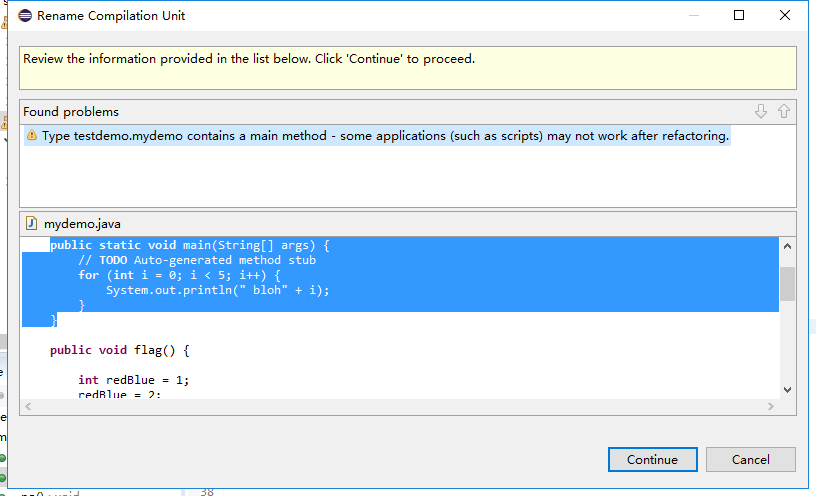

# 1、Java代码结构与流程重构插件
# 2、Java多线程程序数据竞争检测软件
> 由于部分原因，此软件暂不开源
## 项目简介
[2019软件杯赛题地址](http://www.cnsoftbei.com/bencandy.php?fid=155&aid=1681)

> 作品首先开发了一款Eclipse插件用于Java代码的结构与流程重构，实现了代码格式与命名的规范化以及等价语句转换等功能；之后，提出并实现了一款Java多线程程序的并发漏洞检测软件，实现了数据竞争的高效、精准定位。具体功能如下： 
> 1. 使用JDT的CodeFormatter类进行代码格式重构，实现了换行、空白、大括号的自动补全。
> 2. 使用JDT的RenameSupport类进行命名重构，实现了包、类、接口、枚举、方法、常量、成员变量、参数、局部变量名的自动重构。能够正确处理继承、外部依赖等关系，并能动态监测重构中遇到的错误。
> 3. 使用ANTLR进行等价语句转换，实现了for到while、if-else到switch-case、switch-case到if-else以及嵌套if语句到单条if语句的转换。能够正确处理语句的嵌套关系。
> 4. Java多线程程序数据竞争检测：
首先使用SOOT分析并修改程序的字节码，在与并发相关的语句处插入回调函数，从而捕捉多线程程序运行时的相关动作。基于多线程程序的单次运行轨迹可挖掘程序的Petir网模型。该模型虽然由分析单一运行轨迹而得，但其隐含了多条潜在的运行轨迹。其次借助Petir网的展开与分支进程技术，对程序中潜在的数据竞争进行检测。为提高检测效率，使用EsParza提出的最小完备前缀算法对传统的McMillan展开做了优化。最后，为确保数据竞争检测的准确性，使用CalFuzzer调度线程的运行对数据竞争进行重演。

## 特色
> &nbsp;&nbsp;&nbsp;&nbsp;&nbsp;&nbsp;作品前三部分的特色在于部署方便，可在普及度较高的Eclipse下直接运行，并且可实现一些大型工程的重构。作品第四部分的特色在于对已有的数据竞争检测算法做了改进，2003年ACM PLDI上提出的HyBrid与2018年CCF B类会议PPoPP上提出的VerifiedFT都只能针对程序的单次运行轨迹进行检测，而作品由程序的一次运行轨迹出发还原出了多线程程序的并发流程结构，在这个结构的基础上分析出了更多潜在的数据竞争。并且使用CalFuzzer调度线程的运行对数据竞争进行重演，使我们的检测具有更高的真实性。作品首次将Petri网及其展开技术应用于Java多线程程序的动态数据竞争检测，具有一定的理论创新和实际的应用价值。

## 环境
基础组件的开发环境为Win10+JDK 1.8+Antlr 4.4+Eclipse 2019-03。
使用前保证Java环境为JDK 1.7或JDK 1.8，Eclipse版本为2018版及以上即可。

## 安装步骤
> 安装步骤较为简单，只要把我们提供的jar包放在\eclipse\plugins目录下，然后删除\eclipse\configuration\org.eclipse.update\platform.xml，最后重启eclipse就可以了。

## 使用说明
> 安装完成后，启动eclipse，工具栏中会出现插件的图标：

点击图标，插件会自动读取在Eclipse中打开的Java工程，解析每个工程的语法树，并按照“工程名+备份”的命名格式将个工程自动备份到其原目录下。这几项工作完成后，插件会弹窗提示备份完成。

之后会显示作品主界面，通过点击主窗口上面的选项卡来选择相应的重构功能，我们提供了代码格式化、重命名重构、等价语句转换等功能：

> 1. 代码格式化：

“代码规范说明”文本框中介绍了重构时使用的代码格式规范，用户可以在下面的选项栏里选择是否进行代码格式化重构操作。

> 2. 重命名重构：

左边一栏以树状图的形式列出了workspace下的工程结构，包括每个节点的原名称和新名称。需要重构的节点以紫色显示，无法重构的节点标记为#，蓝色底色为建议重命名类型。右侧每个节点的详细信息，
提供自定义重命名操作，例如将yes自定义重命名为no，只需要在自定义重命名下的文本框中输入no，然后点击确定：

若用户不想使用重命名重构功能，可以在下面的选项栏取消该操作。

> 3. 等价语句转换：

作品提供了四个选项，并在后面简单介绍了其功能，用户可以根据需要自行选择。
用户选好需要的功能后，点击右下角的“确定重构”，作品会自动检测程序重构后的命名冲突，并且显示命名冲突的位置：

重构过程中作品会自动提示遇到的问题：

重构完毕后，会显示如下界面：

最左侧以树状图形式列出了每个源文件的路径信息，右侧两个窗口是每个源文件重构前和重构后的代码，并在修改处高亮显示。点击ok，完成重命名重构。
若用户对重构不满意，可以使用Ctrl+Z撤销每步重构，或使用作品提供的工程副本进行恢复。
